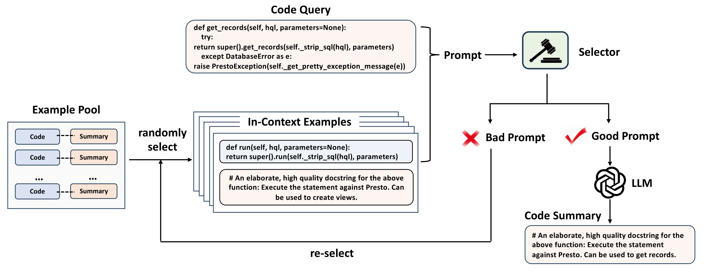
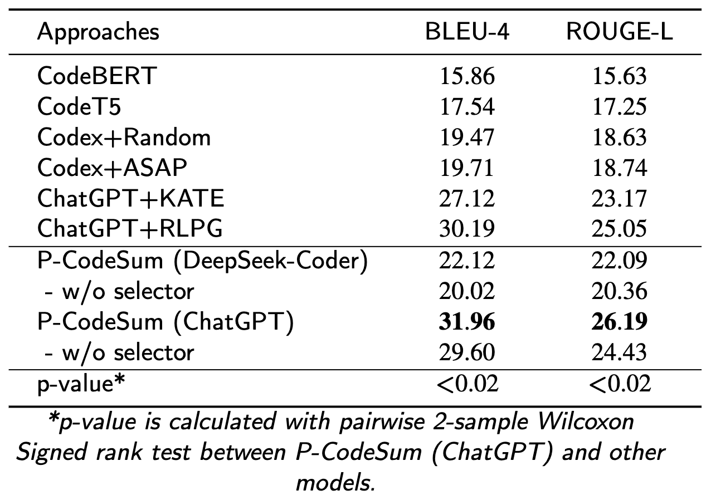

# Project-specific Code Summarization with In-Context Learning

This repo is for the resources of **Project-specific Code Summarization with In-Context Learning**. 

## Summary

Automatically generating summaries for source code has emerged as a valuable task in software development. While state-of-the-art (SOTA) approaches have demonstrated significant efficacy in summarizing general code, they seldom concern code summarization for a specific project. Project-specific code summarization (PCS) poses special challenges due to the scarce availability of training data and the unique styles of different projects. In this work, we empirically analyze the performance of Large Language Models (LLMs) on PCS tasks. Our study reveals that using appropriate prompts is an effective way to solicit LLMs for generating project-specific code summaries. Based on these findings, we propose a novel project-specific code summarization approach called P-CodeSum. P-CodeSum gathers a repository-level pool of (code, summary) examples to characterize the project-specific features. Then, it trains a neural prompt selector on a high-quality dataset crafted by LLMs using the example pool. The prompt selector offers relevant and high-quality prompts for LLMs to generate project-specific summaries. We evaluate P-CodeSum against a variety of baseline approaches on six PCS datasets. Experimental results show that the P-CodeSum improves the performance by 5.9% (RLPG) to 101.51% (CodeBERT) on BLEU-4 compared to the state-of-the-art approaches in project-specific code summarization.

## Overview

The pipeline of P-CodeSum is presented in the figure below.

<br/>

For each specific project, we construct a pool of in-context examples, i.e., (code, summary) pairs. This pool can be utilized throughout the training and prompting stages to characterize the project-specific coding features. Given a query code, our approach randomly selects $K$ examples from the example pool and constructs a prompt candidate following a predefined template. Next, a neural **prompt selector** is designed to discriminate whether the candidate prompt can potentially lead to better summarization. The prompt that is selected by the selector will be fed into an LLM to generate the code summary. Otherwise, a new iteration will begin to re-select other in-context examples until the maximum number of attempts has been reached.

## Prompt Selector

The prompt selector aims to score examples in the pool of project-specific (code, summary) pairs and then select the optimal in-context examples that could elicit LLMs to generate high-quality summaries when acting as prompts. 

Inspired by prompt tuning, we optimize CodeBERT by merely adjusting its input sequence. More specifically, we insert a number of trainable prompt tokens into the input sequence of CodeBERT, which casts the project-specific code summarization task to the same form as the pertaining objective. During training, we only adjust the embedding parameters corresponding to the prompt tokens, while keeping most of the prior knowledge learned during pre-training. 
This mitigates the threat of overfitting with small project-specific data and reduces the computation cost of PLMs significantly. Hence, it allows few-shot learning for pre-trained models with limited labeled samples.

## Data

Training the project-specific prompt selector necessitates the collection of positive and negative data samples. Recognizing the expensive time and effort associated with manual annotation of training data, we employ an LLM to automatically craft high-quality training data.

Firstly, we collect some project-specific code summarization datasets from [CodeXGLUE](https://github.com/microsoft/CodeXGLUE). The original benchmark involves 14 datasets across 10 tasks. We select 6 projects from the code summarization task. These projects are selected to ensure a high diversity of programming languages while keeping the volume of (code, summary) examples in each project within a reasonable range. For each project-specific dataset, we randomly sample 10 examples to build an in-context example pool and 30 examples as the seed of training samples. The remaining examples in dataset are reserved as the testset for evaluation.

The statistics of the datasets we used are presented in the following table:

|Languages|Projects|# of examples|# of in-context examples|# of test examples|
|:------:|:--:|:----:|:----:|:----:|
| Python | h2oai/h2o-3 | 268 | 10 | 228 |
| Java | RestComm/jain-slee | 234 | 10 | 194 |
| Go | dgraph-io/badger | 225  | 10 | 185 |
| Javascript | disnet/contracts.js | 289 | 10 | 249 |
| PHP | Payum/Payum | 277 | 10 | 237 |
| Ruby | chef/omnibus | 199 | 10 | 159 |

Then, we leverage LLMs to generate candidate training samples for prompt selector. For each (code, summary) pairs ($x$, $y$) from the 30 seeds ($y$ is taken as the summary reference of the code query $x$), we select 5 (code, summary) examples from the in-context example pool and use them to construct a corresponding prompt $p$. Then the LLM takes $p$ as input and generates a summary $y'$. For each code query $x$ from the 30 seeds, we select 25 different sets of in-context examples in turn and generate 25 corresponding summaries. We measure the quality of examples using the BLEU-4 and ROUGE-L scores between the generated summary $y'$ and the ground-truth summary $y$. 
We take the average BLEU-4 and ROUGE-L scores of the 25 summaries as the thresholds to judge whether a set of in-context examples are useful for the code query $x$. Examples that gain higher scores than the threshold will be selected to prompt the LLM.

Finally, we obtain a dataset of 750 samples for building the project-specific selector, with 500 and 250 for training and testing, respectively. Each training sample consists of three fields, including a code query, five in-context examples, and a label indicating whether the sample is useful or not.

Code of generating the training data for prompt selector is under **./code/datagen**.

Train/test data for prompt selector of each project is under **./data**.

## Method

Code of our approach is under **./code/method**.

### Train

train P-CodeSum in **./run/train.sh**.
```
source ./run/train.sh
```

### Evaluate

evaluate P-CodeSum in **./run/evaluate.sh**.
```
source ./run/evaluate.sh
```

## Main Results

We compare P-CodeSum against two categories of code summarization techniques, namely, fine-tuned code PLMs and LLMs with in-context learning. For fine-tuned code PLMs, we select CodeBERT and CodeT5, representing encode-only and encode-decode models, respectively. In the realm of LLMs, we choose ChatGPT and Codex. We employ various strategies for selecting in-context examples, including random selection, prompt retrieval, and prompt learning. We also evaluate P-CodeSum on two LLMs: DeepSeek-Coder (6.7b) and ChatGPT (text-davinci-003). All the baselines demonstrate impressive performance on code summarization tasks. Overall, our approach (ChatGPT+P-CodeSum) significantly outperforms all baselines.

To assess the impact of the prompt selector, we compare P-CodeSum with a variant that excludes the prompt selector, i.e., randomly selects in-context examples from the example pool. By using the prompt selector, both ChatGPT and DeepSeek-Coder attain a soar improvement in performance. This indicates that the prompt selector is an essential component in P-CodeSum to generating high-quality project-specific code summaries.

<div style="text-align:center;">
  
</div>
